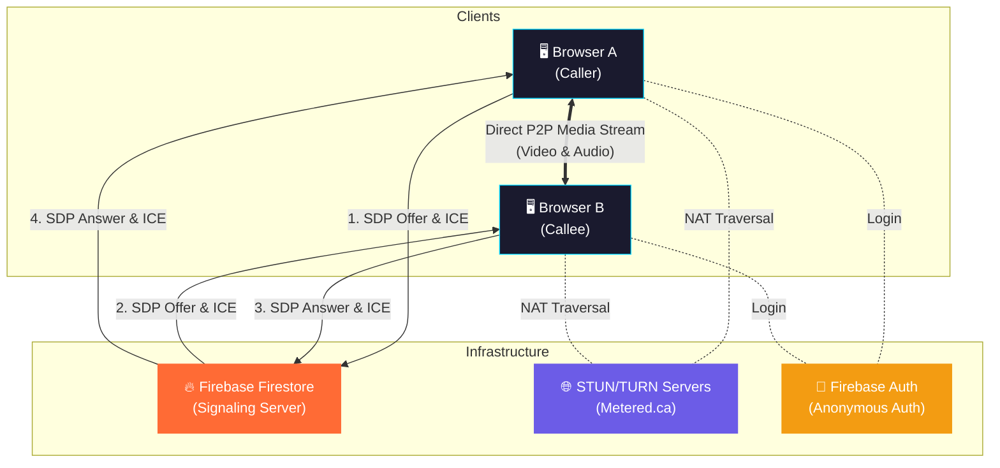

# 🔗 Vibe Connect

> Anonymous peer-to-peer video chat — connect with strangers instantly.

A real-time video chat web application built with **Next.js 16**, **WebRTC**, and **Firebase**. Users are matched anonymously and communicate via direct peer-to-peer video and audio streams with no accounts, no sign-ups, and no data stored.

**🌍 Live Demo:** [https://omegle-clone-silk.vercel.app](https://omegle-clone-silk.vercel.app)

---

## 📑 Table of Contents

- [Features](#-features)
- [Tech Stack](#-tech-stack)
- [System Architecture](#-system-architecture)
- [Application Workflow](#-application-workflow)
- [Database Schema (Firestore)](#-database-schema-firestore)
- [Project Structure](#-project-structure)
- [Prerequisites](#-prerequisites)
- [Setup & Installation](#-setup--installation)
- [Environment Variables](#-environment-variables)
- [Running Locally](#-running-locally)
- [Deployment (Vercel)](#-deployment-vercel)
- [Firebase Configuration Guide](#-firebase-configuration-guide)
- [STUN/TURN Server Setup](#-stunturn-server-setup)
- [Troubleshooting](#-troubleshooting)
- [Contributing](#-contributing)
- [License](#-license)

---

## ✨ Features

- **Anonymous Video Chat** — Instantly connect with a random stranger. No login, no profile.
- **Peer-to-Peer Communication** — Real-time, low-latency video and audio streaming using WebRTC.
- **Firebase Signaling** — Connection negotiation (offers, answers, ICE candidates) handled via Firebase Firestore.
- **Anonymous Authentication** — Frictionless entry using Firebase Anonymous Auth (unique UID per session).
- **Next / Skip** — One click to disconnect and find a new stranger.
- **Mute / Unmute** — Toggle your microphone on or off during a call.
- **Camera On / Off** — Toggle your camera feed during a call.
- **Fullscreen Mode** — Expand the remote stranger's video to fullscreen.
- **Floating Local Video** — Your own camera feed appears as a picture-in-picture overlay.
- **Responsive Design** — Works on desktop and mobile browsers.

---

## 🛠️ Tech Stack

| Layer | Technology | Purpose |
|---|---|---|
| **Framework** | [Next.js 16](https://nextjs.org/) (App Router) | Server-side rendering, routing, deployment |
| **UI Library** | [React 19](https://react.dev/) | Component-based UI |
| **Language** | [TypeScript](https://www.typescriptlang.org/) | Type-safe JavaScript |
| **Styling** | [Tailwind CSS v4](https://tailwindcss.com/) | Utility-first CSS framework |
| **Authentication** | [Firebase Auth](https://firebase.google.com/docs/auth) | Anonymous authentication |
| **Signaling Server** | [Firebase Firestore](https://firebase.google.com/docs/firestore) | Real-time WebRTC signaling & matchmaking |
| **Real-time Media** | [WebRTC](https://webrtc.org/) | Peer-to-peer video/audio streaming |
| **NAT Traversal** | [Metered STUN/TURN](https://www.metered.ca/) | ICE servers for connecting peers behind NATs/firewalls |
| **Hosting** | [Vercel](https://vercel.com/) | Frontend deployment with auto-deploy from GitHub |

---

## 🏗️ System Architecture



### How It Works (Summary)

1. **Firebase Firestore** acts as the signaling server — it does NOT carry any media. It only coordinates the initial handshake between two peers.
2. **WebRTC** handles the actual video/audio streams directly between browsers (peer-to-peer).
3. **STUN servers** help each browser discover its public IP address.
4. **TURN servers** relay media only when a direct P2P connection is impossible (e.g., strict corporate firewalls).
5. **Firebase Anonymous Auth** gives each user a temporary UID without requiring any sign-up.

---

## 🔄 Application Workflow

### Phase 1: Matchmaking

```
User clicks "Start"
        │
        ▼
Query Firestore `waiting` collection
(ordered by createdAt, limit 1)
        │
        ├── Collection is EMPTY ──────────►  Create doc in `waiting`
        │                                     Role = CALLER
        │                                     Wait for a partner...
        │
        └── Document EXISTS ──────────────►  Delete that doc from `waiting`
                                              Role = CALLEE
                                              Use doc ID as Room ID
```

### Phase 2: WebRTC Signaling

```
CALLER                              CALLEE
  │                                    │
  │  1. Create RTCPeerConnection       │
  │  2. Add local media tracks         │
  │  3. Create SDP Offer               │
  │  4. Set local description          │
  │  5. Write offer to Firestore       │
  │  ──────────── offer ──────────►    │
  │                                    │  6. Read offer from Firestore
  │                                    │  7. Set remote description
  │                                    │  8. Create SDP Answer
  │                                    │  9. Set local description
  │    ◄──────── answer ──────────     │  10. Write answer to Firestore
  │                                    │
  │  11. Set remote description        │
  │                                    │
  │  ◄──── ICE Candidates ────►        │  (exchanged via Firestore sub-collections)
  │                                    │
  │  ════ P2P Media Stream ════        │  (direct connection established)
  │                                    │
```

### Phase 3: Media Flow

Once signaling completes, the `RTCPeerConnection` establishes a direct P2P connection (or relays via TURN if needed). Video and audio streams flow directly between the two browsers — Firebase is no longer involved.

### Phase 4: Call End / Next

- **End**: Closes the `RTCPeerConnection`, stops remote tracks, unsubscribes from Firestore listeners.
- **Next**: Runs cleanup (same as End), then immediately starts a new matchmaking cycle.

---

## 🗄️ Database Schema (Firestore)

### `waiting` Collection

Stores users who are waiting to be matched with a stranger.

| Field | Type | Description |
|---|---|---|
| `createdAt` | `Timestamp` | When the user started waiting. Used to match the earliest waiting user first (FIFO). |

> **Lifecycle:** A document is created when a user clicks Start and no one is waiting. It is deleted by the next user who joins, who then uses the document's ID as the shared Room ID.

### `rooms` Collection

Stores the WebRTC signaling data for an active call between two peers.

| Field | Type | Description |
|---|---|---|
| `createdAt` | `Timestamp` | When the room was created. |
| `offer` | `Object` | The WebRTC SDP offer generated by the Caller. Contains `type` and `sdp` fields. |
| `answer` | `Object` | The WebRTC SDP answer generated by the Callee. Contains `type` and `sdp` fields. |

#### `rooms/{roomId}/callerCandidates` Sub-collection

Each document contains one ICE candidate from the Caller:

| Field | Type | Description |
|---|---|---|
| `candidate` | `string` | The ICE candidate string. |
| `sdpMid` | `string` | Media stream identification tag. |
| `sdpMLineIndex` | `number` | Index of the media description. |

#### `rooms/{roomId}/calleeCandidates` Sub-collection

Same structure as `callerCandidates`, but for the Callee's ICE candidates.

---

## 📁 Project Structure

```
vibe-connect/
│
├── frontend/                        # Next.js application
│   ├── app/                         # App Router directory
│   │   ├── page.tsx                 # Main page — all video chat logic
│   │   ├── layout.tsx               # Root layout with metadata
│   │   ├── globals.css              # Global styles (Tailwind imports)
│   │   └── favicon.ico              # Site favicon
│   │
│   ├── src/
│   │   └── lib/
│   │       └── firebase.ts          # Firebase initialization (reads env vars)
│   │
│   ├── public/                      # Static assets
│   ├── package.json                 # Dependencies and scripts
│   ├── package-lock.json            # Locked dependency versions
│   ├── next.config.ts               # Next.js configuration
│   ├── tsconfig.json                # TypeScript configuration
│   ├── postcss.config.mjs           # PostCSS config (Tailwind)
│   └── eslint.config.mjs            # ESLint configuration
│
├── backend/                         # Reserved for future backend (currently empty)
│   └── .gitkeep
│
├── .gitignore                       # Ignored files (node_modules, .env, .next, etc.)
└── README.md                        # This file
```

### Key Files Explained

| File | Purpose |
|---|---|
| `frontend/app/page.tsx` | The entire video chat application — matchmaking, WebRTC, UI rendering |
| `frontend/src/lib/firebase.ts` | Initializes Firebase app, exports `db` (Firestore) and `auth` (Auth) instances |
| `frontend/app/layout.tsx` | Root HTML layout, sets `<title>` and `<meta>` tags |
| `frontend/app/globals.css` | Tailwind CSS imports and global styles |

---

## 📋 Prerequisites

Before running the project, make sure you have:

- **Node.js** v20 or higher — [Download](https://nodejs.org/)
- **npm** (comes with Node.js), or **yarn** / **pnpm**
- A **Firebase Project** — [Create one here](https://console.firebase.google.com/)
  - Firestore Database enabled
  - Anonymous Authentication enabled
- *(Optional)* A **Metered.ca** account for your own TURN server credentials — [Sign up](https://www.metered.ca/)

---

## 🚀 Setup & Installation

### 1. Clone the repository

```bash
git clone https://github.com/Ojaswi-Gupta/omegle_clone.git
cd omegle_clone/frontend
```

### 2. Install dependencies

```bash
npm install
```

Or with yarn/pnpm:
```bash
yarn install
# or
pnpm install
```

### 3. Create environment file

Create a `.env.local` file inside the `frontend/` directory:

```bash
touch .env.local
```

Add the following variables (see [Environment Variables](#-environment-variables) for details):

```env
NEXT_PUBLIC_FIREBASE_API_KEY=your_api_key
NEXT_PUBLIC_FIREBASE_AUTH_DOMAIN=your_auth_domain
NEXT_PUBLIC_FIREBASE_PROJECT_ID=your_project_id
NEXT_PUBLIC_FIREBASE_STORAGE_BUCKET=your_storage_bucket
NEXT_PUBLIC_FIREBASE_MESSAGING_SENDER_ID=your_messaging_sender_id
NEXT_PUBLIC_FIREBASE_APP_ID=your_app_id
```

### 4. Run the development server

```bash
npm run dev
```

Open [http://localhost:3000](http://localhost:3000) in your browser.

> **Note:** Camera and WebRTC work on `localhost` without HTTPS. For testing on other devices on your network, you need HTTPS.

---

## 🔐 Environment Variables

All environment variables are prefixed with `NEXT_PUBLIC_` because they are used client-side by Firebase SDK.

| Variable | Required | Description |
|---|---|---|
| `NEXT_PUBLIC_FIREBASE_API_KEY` | ✅ | Firebase Web API Key |
| `NEXT_PUBLIC_FIREBASE_AUTH_DOMAIN` | ✅ | Firebase Auth domain (e.g., `your-project.firebaseapp.com`) |
| `NEXT_PUBLIC_FIREBASE_PROJECT_ID` | ✅ | Firebase project ID |
| `NEXT_PUBLIC_FIREBASE_STORAGE_BUCKET` | ✅ | Firebase storage bucket URL |
| `NEXT_PUBLIC_FIREBASE_MESSAGING_SENDER_ID` | ✅ | Firebase Cloud Messaging sender ID |
| `NEXT_PUBLIC_FIREBASE_APP_ID` | ✅ | Firebase app ID |

### Where to find these values

1. Go to [Firebase Console](https://console.firebase.google.com/)
2. Select your project
3. Click the **gear icon** (⚙️) → **Project settings**
4. Scroll down to **"Your apps"** → Select your Web App
5. Copy the `firebaseConfig` object values

---

## 🌍 Deployment (Vercel)

The app is deployed on Vercel with auto-deploy from GitHub.

### How it works

1. Push code to `main` branch on GitHub
2. Vercel automatically detects the push and builds the project
3. The new version goes live within ~60 seconds

### Vercel Project Settings

| Setting | Value |
|---|---|
| **Framework Preset** | Next.js |
| **Root Directory** | `frontend` |
| **Build Command** | `next build` (auto-detected) |
| **Output Directory** | `.next` (auto-detected) |

### Setting Environment Variables on Vercel

Your `.env.local` file is **NOT** deployed (it's gitignored). You must add env vars in Vercel:

1. Go to [Vercel Dashboard](https://vercel.com/dashboard)
2. Click your project
3. Navigate to **Settings** → **Environment Variables**
4. Add all 6 `NEXT_PUBLIC_FIREBASE_*` variables
5. Set them for **Production**, **Preview**, and **Development**
6. Redeploy if needed (Deployments → click `...` → Redeploy)

---

## 🔥 Firebase Configuration Guide

### Step 1: Create a Firebase Project

1. Go to [Firebase Console](https://console.firebase.google.com/)
2. Click **"Create a project"** (or select existing)
3. Give it a name and follow the setup wizard

### Step 2: Add a Web App

1. In the Firebase project dashboard, click the **Web icon** (`</>`)
2. Register your app with a nickname
3. Copy the `firebaseConfig` values into your `.env.local`

### Step 3: Enable Anonymous Authentication

1. Go to **Authentication** → **Sign-in method**
2. Click **Anonymous**
3. Toggle it **ON** and save

### Step 4: Create Firestore Database

1. Go to **Firestore Database** → **Create database**
2. Choose **Start in test mode** (for development)
3. Select a region close to your users

### Step 5: Configure Firestore Security Rules

For development/testing:

```
rules_version = '2';
service cloud.firestore {
  match /databases/{database}/documents {
    match /{document=**} {
      allow read, write: if request.auth != null;
    }
  }
}
```

> **⚠️ For production**, write more restrictive rules that limit access to `waiting` and `rooms` collections only.

### Step 6: Add Authorized Domains

1. Go to **Authentication** → **Settings** → **Authorized domains**
2. Add your Vercel deployment domain (e.g., `omegle-clone-silk.vercel.app`)
3. Add any custom domains you use

---

## 📡 STUN/TURN Server Setup

WebRTC requires STUN/TURN servers for NAT traversal. The app currently uses [Metered.ca](https://www.metered.ca/) servers.

### What are STUN/TURN servers?

- **STUN (Session Traversal Utilities for NAT):** Helps a client discover its public IP address and port. Free and lightweight.
- **TURN (Traversal Using Relays around NAT):** Relays media traffic when a direct P2P connection fails (e.g., behind symmetric NATs or strict firewalls). Costs bandwidth.

### Current Configuration

The ICE server configuration is defined in `frontend/app/page.tsx`:

```typescript
const iceServers: RTCIceServer[] = [
  {
    urls: "stun:stun.relay.metered.ca:80"
  },
  {
    urls: [
      "turn:global.relay.metered.ca:80?transport=udp",
      "turns:global.relay.metered.ca:443?transport=tcp"
    ],
    username: "your_turn_username",
    credential: "your_turn_credential"
  }
];
```

### Getting Your Own TURN Credentials

1. Sign up at [metered.ca](https://www.metered.ca/)
2. Create a new app
3. Go to **TURN Server** section
4. Copy the TURN server URLs, username, and credential
5. Replace the values in `page.tsx`

---

## 🐛 Troubleshooting

### Camera not working

| Cause | Fix |
|---|---|
| Browser blocked camera access | Click the camera icon in the address bar and allow access |
| Site not on HTTPS | Use `localhost` for dev, or deploy to Vercel (HTTPS) for cross-device testing |
| Another app using the camera | Close other apps that use the camera (Zoom, Teams, etc.) |

### "Firebase Auth error" in console

| Cause | Fix |
|---|---|
| Anonymous Auth not enabled | Enable it in Firebase Console → Authentication → Sign-in method |
| Domain not authorized | Add your domain to Firebase Console → Authentication → Settings → Authorized domains |
| Wrong env variables | Double-check all 6 `NEXT_PUBLIC_FIREBASE_*` vars in `.env.local` |

### Video connection not establishing

| Cause | Fix |
|---|---|
| Firewall blocking WebRTC | Ensure TURN servers are configured (they relay traffic when P2P fails) |
| TURN credentials expired | Get fresh credentials from Metered.ca dashboard |
| Firestore rules too restrictive | Check Firestore rules allow authenticated users to read/write |

### "Waiting for a stranger..." forever

| Cause | Fix |
|---|---|
| No other user is online | Open two browser tabs/windows to test locally |
| Stale entries in `waiting` collection | Manually delete old documents from Firestore Console |
| Firestore read/write failing | Check browser console for Firestore permission errors |

### Build errors on Vercel

| Cause | Fix |
|---|---|
| Missing env variables | Add all `NEXT_PUBLIC_FIREBASE_*` vars in Vercel Dashboard → Settings → Environment Variables |
| Root directory not set | Set **Root Directory** to `frontend` in Vercel project settings |
| Wrong Node.js version | Ensure Vercel uses Node.js 20+ (Settings → General → Node.js Version) |

---

## 🤝 Contributing

Contributions are welcome! Here's how:

1. **Fork** the repository
2. **Create a branch** for your feature:
   ```bash
   git checkout -b feature/your-feature-name
   ```
3. **Make your changes** and commit:
   ```bash
   git commit -m "feat: add your feature description"
   ```
4. **Push** to your fork:
   ```bash
   git push origin feature/your-feature-name
   ```
5. **Open a Pull Request** on GitHub

### Development Guidelines

- Keep code in TypeScript
- Follow existing code style
- Test with two browser windows before submitting
- Don't commit `.env.local` or any credentials

---

## 📄 License

This project is open source and available for personal and educational use.

---

**Built with ❤️ by [Ojaswi Gupta](https://github.com/Ojaswi-Gupta)**